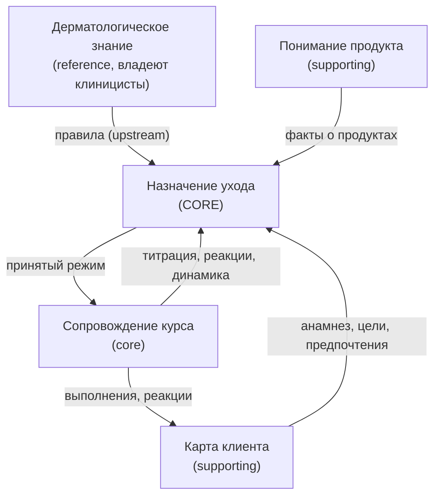

# Mirra Architecture v1

> **Статус:** канонический архитектурный справочник. Опирается на Доменную модель v1.0 (заморожена).
> **Аудитория:** каждый инженер, дизайнер и ИИ-агент, работающий над Mirra.
> **Назначение:** объяснить, как программное обеспечение *выводится* из доменной модели ухода за кожей — а не как домен подгоняется под софт.
> Этот документ — мост между бизнес-доменом и архитектурой. Он не описывает реализацию.

---

## 1. Архитектурные принципы

Каждое архитектурное решение обязано проходить проверку этими принципами. Порядок не случаен: принципы выше по списку побеждают при конфликте.

### P1. Домен прежде софта
Модель домена (агрегаты, инварианты, единый язык) первична; софт — её исполнение. Новая фича обязана сначала ответить «какой концепт домена она проявляет?» — и только потом получать экран, таблицу или код.
**Нарушение:** софт начинает лепить домен под себя; появляются «сущности ради экрана», которые невозможно объяснить дерматологу — и невозможно потом удалить.

### P2. Единый язык — везде
Термины глоссария используются в коде, БД, тикетах, промптах ИИ и интерфейсе. Канонический словарь двуязычен:

| Домен (RU) | Код (EN) | Домен (RU) | Код (EN) |
|---|---|---|---|
| Косметичка | CosmeticBag | Обоснование | Rationale |
| Продукт | Product | Предупреждение | Warning |
| Состав | Composition | Переносимость | Tolerance |
| Класс актива | ActiveClass | Титрация | Titration |
| Свойство состава | FormulationProperty | Курс | Course |
| Режим ухода | Regimen | Фаза | Phase |
| Назначение | Prescription | Дневник ухода | Journal |
| Директива применения | Directive | Реакция | Reaction |
| Цель | Goal | Динамика | ObservedEffect |
| Предпочтение | Preference | Анамнез | Anamnesis |
| Очередь введения | IntroductionQueue | Свод знаний | Knowledge |

**Нарушение:** один концепт под тремя именами → рассинхронизация команд, дубли таблиц, ИИ-агенты, «понимающие» домен по-разному.

### P3. Софт ускоряет решения, но не создаёт их
Каждую автоматику можно выключить и заменить человеком с блокнотом — модель этого не заметит. Расшифровка состава ускоряет то, что дерматолог делает глазами; раскладка по дням — то, что он делает карандашом; сгенерированный текст — то, что он говорит голосом.
**Нарушение:** решения «прорастают» в технологию (в LLM, в оптимизатор), становятся невоспроизводимыми и необъяснимыми.

### P4. Директивы — источник истины; календарь — проекция
Канонично: «вечером, 3 раза в неделю, не в дни кислот, после очищения». Раскладка «Пн/Ср/Пт» — вычисляемое представление, которое можно пересчитать, перерисовать или дать пользователю перекроить руками, не тронув ни одного назначения.
**Нарушение:** хранение дней как истины делает невозможными ручное редактирование, смену планировщика и титрацию — любое изменение частоты превращается в миграцию данных.

### P5. Каждая рекомендация несёт обоснование
Назначение без обоснования не существует (инвариант 1). Обоснование создаётся *в момент решения* тем, кто решил, со ссылками на правила Свода и факты. Тексты для человека — вербализация обоснования, не его источник.
**Нарушение:** «объяснения задним числом» дрейфуют от настоящих причин — для продукта с медицинской ответственностью это дисквалификация.

### P6. Экран — проекция агрегатов; UI не владеет логикой
Любой экран отвечает на вопрос «проекцией каких агрегатов я являюсь и какие команды домена запускаю?».
**Нарушение:** логика в UI («спрятать кнопку при беременности») обходится любым другим клиентом, API или импортом. Правильно: «назначение противопоказанного класса не может существовать» — и тогда никакой интерфейс его не создаст.

### P7. Инварианты живут в домене
Все 12 инвариантов модели соблюдаются агрегатами, а не проверками на клиенте.
**Нарушение:** инвариант, продублированный в трёх клиентах, — это три версии инварианта.

### P8. Детерминизм и воспроизводимость решений
Один и тот же вход + та же версия Свода знаний → байт-в-байт тот же режим и та же раскладка. LLM не участвует в цепочке принятия решений (см. §8).
**Нарушение:** невоспроизводимое назначение нельзя ни отладить, ни защитить перед клиницистом.

---

## 2. Карта ограниченных контекстов

Пять доменных контекстов. Презентация (экраны, пуши) — не контекст, а слой проекций и доставки.

### 2.1 Понимание продукта (Product Understanding)
- **Назначение:** превратить физическую банку в структурированные факты.
- **Ответственность:** скан → Состав → распознанные Активы (с Силой) и Свойства состава.
- **Корень агрегата:** Косметичка. **Сущности:** Продукт. **VO:** ИмяИнгредиента, КлассАктива, Сила, СвойствоСостава.
- **События:** ПродуктДобавлен, СоставРасшифрован, ПродуктЗакончился.
- **Внешние зависимости:** OCR, каталоги INCI (INCIDecoder и т.п.).
- **Владеет данными:** продукты и их факты.

### 2.2 Дерматологическое знание (Knowledge)
- **Назначение:** машиночитаемая дерматология с клиническим управлением.
- **Ответственность:** Взаимодействия, Противопоказания, Правила применения (частоты, лестницы титрации). Субъект правила: класс актива / ингредиент / свойство состава.
- **Сущности:** Взаимодействие, Противопоказание, ПравилоПрименения — каждая с доказательностью, версией, историей пересмотров.
- **События:** ПравилоПересмотрено (внутренний governance).
- **Внешние зависимости:** литература, клиницисты. **Владеет данными:** правила.
- **Отношение к потребителям:** upstream-supplier; потребители конформны (не переопределяют правила у себя).

### 2.3 Карта клиента (Client Card)
- **Назначение:** всё, что дерматолог записал бы в карту пациента.
- **Ответственность:** Анамнез (кожа + обстоятельства: беременность, препараты, климат/сезон), Цели, Предпочтения, Переносимость по классам активов.
- **Корень агрегата:** Кожа (карта). **VO:** Цель, Предпочтение, СтупеньТитрации, происхождение.
- **События:** АнамнезОбновлён, ЦельИзменена, ПредпочтениеЗаявлено/Изменено.
- **Владеет данными:** карта клиента. Переносимость меняется только на основании Дневника (событий из контекста 2.5).

### 2.4 Назначение ухода (Care Planning) — ядро
- **Назначение:** составить и вести Режим — как это сделал бы дерматолог.
- **Ответственность:** Оценка совместимости (доменная служба), составление Режима, Предупреждения, очередь введения.
- **Корень агрегата:** Режим ухода. **Сущности:** Назначение. **VO:** Директива, Обоснование, Вердикт, ОбластьВзаимодействия, СпособРазрешения.
- **События:** РежимСоставлен, РежимПринят, НазначениеДобавлено/Приостановлено/Возобновлено/Завершено, ДирективаУточнена, ПредупреждениеЗафиксировано.
- **Потребляет проекции:** фактов о продуктах (2.1), карты (2.3), правил (2.2). **Владеет данными:** режимы.

### 2.5 Сопровождение курса (Course Guidance)
- **Назначение:** развитие ухода во времени и обратная связь кожи.
- **Ответственность:** Курс и Фазы, Дневник (выполнения, реакции, события ухода, динамика), титрация.
- **Корни агрегатов:** Курс, Дневник. **VO:** ОписаниеРеакции, Динамика.
- **События:** УходВыполнен, РеакцияОтмечена, ДинамикаЗафиксирована, АктивВведён, ТитрацияПовышена/Снижена, ФазаЗавершена.
- **Владеет данными:** курсы и дневники.

**Коммуникация контекстов** — только доменные события и read-only проекции. Ни один контекст не пишет в чужой агрегат. Знание — строго upstream: его правила потребляются как есть; несогласие с правилом — это пересмотр в Своде, а не локальная правка.

---

## 3. Карта агрегатов

| Агрегат | Ответственность | Ключевые инварианты | Жизненный цикл | Владеет | Издаёт | Потребляет |
|---|---|---|---|---|---|---|
| **Косметичка** | продукты человека | продукт доступен/закончился; дубли различимы; просроченное не назначаемо | пополняется/истощается | Продукты (Состав, факты) | ПродуктДобавлен, СоставРасшифрован, ПродуктЗакончился | — |
| **Кожа (карта)** | анамнез, цели, предпочтения, переносимость | переносимость меняется только по Дневнику; происхождение у Состояний | живёт с клиентом | Цели, Предпочтения | АнамнезОбновлён, ЦельИзменена, Предпочтение* | УходВыполнен, РеакцияОтмечена |
| **Свод знаний** | правила дерматологии | правило действует после клин. пересмотра; версия и доказательность обязательны | версионируется | Взаимодействия, Противопоказания, ПравилаПрименения | ПравилоПересмотрено | — |
| **Режим ухода** | действующий набор назначений | №1 обоснование; №2 ретиноид→вечер+SPF; №3 беременность; №4 чередование или Предупреждение; №5 недельный cap класса; №6 бюджет раздражения; №9 порядок; №10 очередь; №11 предпочтения | предложен → принят → архивирован; авторство | Назначения (Директивы, Обоснования), Предупреждения | Режим*, Назначение*, ДирективаУточнена, ПредупреждениеЗафиксировано | СоставРасшифрован, АнамнезОбновлён, Титрация*, Предпочтение* |
| **Курс** | фазы, развитие режима | фазы не перекрываются; №7 один новый актив; №12 окно оценки | открыт → фазы → поддержка | Фазы | АктивВведён, Титрация*, ФазаЗавершена | РеакцияОтмечена, ДинамикаЗафиксирована, РежимПринят |
| **Дневник** | хронология наблюдений | только пополняется; записи неизменяемы | бесконечен | записи | УходВыполнен, РеакцияОтмечена, ДинамикаЗафиксирована | — |

**Почему границы именно такие.** Косметичка отделена от Режима: владение продуктом ≠ его применение. Кожа отделена от Курса: карта — состояние человека, курс — процесс лечения. Дневник отделён от всех: неизменяемая хронология — источник, из которого *выводятся* переносимость и динамика, и он не должен зависеть от их интерпретации. Режим — единственный агрегат, где сходятся все ограничения, поэтому все «конфликтные» инварианты живут в нём.

---

## 4. Доменные команды

Команда = намерение пользователя (или клинициста) на языке домена. Не API.

| Команда | Предусловия | Инварианты | События | Агрегаты |
|---|---|---|---|---|
| ДобавитьПродукт | скан получен | — | ПродуктДобавлен | Косметичка |
| РасшифроватьСостав | продукт есть | — | СоставРасшифрован | Косметичка |
| ОтметитьОкончание | продукт доступен | назначения на него завершаются | ПродуктЗакончился, НазначениеЗавершено | Косметичка, Режим |
| ОбновитьАнамнез | — | №3 (каскад при беременности) | АнамнезОбновлён, [НазначениеПриостановлено…] | Кожа, Режим |
| ИзменитьЦель | — | — | ЦельИзменена | Кожа |
| Заявить/ИзменитьПредпочтение | — | №11 (режим обязан вписаться) | Предпочтение*, [РежимСоставлен] | Кожа, Режим |
| СоставитьРежим | ≥1 продукт с фактами | №1–№6, №9–№11 | РежимСоставлен, ПредупреждениеЗафиксировано* | Режим |
| ПринятьРежим | режим предложен | все инварианты режима | РежимПринят | Режим, Курс |
| ДобавитьНазначение | продукт в косметичке | №4, №5, №9, №11 | НазначениеДобавлено | Режим |
| ПриостановитьНазначение | назначение активно | — | НазначениеПриостановлено | Режим |
| ВозобновитьНазначение | приостановлено | №3, №5, №7 | НазначениеВозобновлено | Режим |
| УточнитьДирективу | назначение активно | №4 (иначе Предупреждение) | ДирективаУточнена | Режим |
| ОтметитьВыполнение | принят режим | — | УходВыполнен | Дневник |
| ОтметитьРеакцию | — | №8 (каскад: блок/снижение титрации) | РеакцияОтмечена, [ТитрацияСнижена] | Дневник, Курс, Кожа |
| ЗафиксироватьДинамику | цель существует | №12 | ДинамикаЗафиксирована | Дневник, Курс |
| ПовыситьТитрацию | окно без реакций пройдено | №7, №8, №5 | ТитрацияПовышена | Курс, Кожа, Режим |
| ЗавершитьФазу | критерий фазы выполнен | фазы не перекрываются | ФазаЗавершена | Курс |

Три команды, требующие комментария:

- **УточнитьДирективу** — это перетаскивание дня в календаре. Пользователь не «редактирует расписание» — он сужает частоту «3×/нед» до «вт/чт/сб». Если сужение нарушает чередование, домен не запрещает, а фиксирует Предупреждение.
- **ОбновитьАнамнез (беременность)** — единственная команда с безусловным каскадом: инвариант 3 приостанавливает противопоказанные назначения немедленно и без участия UI.
- **ОтметитьРеакцию** — вторая каскадная: выраженная реакция обязана снизить титрацию (инвариант 8). Каскады — доменные, не «фичи приложения».

---

## 5. Каталог событий

### Доменные события (прошедшее время, язык домена, неизменяемый payload)

| Событие | Смысл и зачем | Производитель | Потребители | Payload |
|---|---|---|---|---|
| ПродуктДобавлен | банка появилась у человека | Косметичка | проекции | продукт, дата |
| СоставРасшифрован | факты о формуле готовы | Косметичка | Режим (пересоставление возможно), проекции | продукт, активы+сила, свойства состава, confidence |
| ПродуктЗакончился | банка выбыла | Косметичка | Режим, очередь введения | продукт |
| АнамнезОбновлён | карта изменилась | Кожа | Режим (инв. 3), проекции | изменённые поля, происхождение |
| ЦельИзменена | желаемое изменилось | Кожа | Режим, Курс | цели с приоритетами |
| ПредпочтениеЗаявлено/Изменено | рамка приемлемости | Кожа | Режим (инв. 11) | предпочтение |
| РежимСоставлен | предложен новый режим | Режим | проекции, Курс | назначения, предупреждения, авторство |
| РежимПринят | режим вступил в силу | Режим | Курс, календарь, напоминания | версия режима |
| НазначениеДобавлено / Приостановлено / Возобновлено / Завершено | судьба назначения | Режим | проекции, календарь | назначение, причина, обоснование |
| ДирективаУточнена | директива сужена | Режим | календарь | назначение, директива |
| ПредупреждениеЗафиксировано | неустранимый риск | Режим | проекции, тексты | предупреждение, правило-источник |
| АктивВведён | новый класс вошёл в уход | Курс | Кожа (переносимость) | класс, ступень |
| ТитрацияПовышена/Снижена | ступень изменилась | Курс | Режим (частоты), Кожа | класс, ступень, причина |
| УходВыполнен | утро/вечер сделаны | Дневник | Кожа, Курс, прогресс | дата, часть дня |
| РеакцияОтмечена | нежелательный ответ | Дневник | Курс (инв. 8), Кожа | описание, степень, привязка |
| ДинамикаЗафиксирована | движение к цели | Дневник | Курс (инв. 12), прогресс | цель, оценка, происхождение |
| ФазаЗавершена | критерий выполнен | Курс | Режим, проекции | фаза, итог |

### Технические события (не входят в доменную модель)

| Событие | Смысл | Замечание |
|---|---|---|
| СканЗагружен, РаспознаваниеЗавершено | этапы конвейера OCR | предшествуют СоставРасшифрован |
| КалендарьПересчитан | проекция обновлена | никогда не меняет директивы |
| НапоминаниеЗапланировано/Доставлено | доставка пушей | вестник события «пора выполнить уход» |

Правило: доменное событие описывает факт из мира ухода за кожей; техническое — факт из мира машин. Техническое событие никогда не является причиной изменения агрегата.

---

## 6. Проекции (read models)

| Проекция | Источник | Триггер пересчёта | Что показывает |
|---|---|---|---|
| **Косметичка (экран)** | Косметичка + Режим | Продукт*, Назначение* | продукты, бейджи «не в рутине», факты |
| **Недельный календарь** | Режим (директивы) | РежимПринят, Директива*, Назначение* | раскладку по дням; вычисляется из директив детерминированно |
| **Сегодня** | календарь + Дневник | УходВыполнен, время | шаги на сейчас, чекофы |
| **Прогресс** | Дневник, Курс | УходВыполнен, Динамика* | регулярность, динамика по целям, фаза курса |
| **История** | Дневник, версии Режима | append-only | хронология ухода и решений |
| **Предупреждения** | Режим | ПредупреждениеЗафиксировано | риски с обоснованиями |
| **Очередь введения** | Режим | Назначение*, ПродуктЗакончился | что и почему ждёт, условие готовности |

**Почему это проекции.** Каждая — детерминированная функция от агрегатов; её можно стереть и пересчитать без потери истины. Устаревание деградирует мягко: несвежий календарь → напоминание опоздает; несвежий прогресс → цифра отстанет. Единственная проекция с требованием немедленности — **Предупреждения**: она обязана пересчитываться синхронно с изменением Режима, потому что показывает риски.

Пороговое правило: как только у проекции появляются *собственные* команды и инварианты — она перестала быть проекцией, и это сигнал к пересмотру модели (см. §11). Сегодняшний пример-антипаттерн: если бы «раскладка» получила собственные правила, не выводимые из директив, — но по ADR-1/ADR-2 мы вместо этого сужаем директиву.

---

## 7. Прикладные службы (application services)

Службы координируют агрегаты; **решений не принимают** — все решения в агрегатах и доменных службах.

| Служба | Оркестрирует | Что ей запрещено |
|---|---|---|
| **Составитель режима** | факты продуктов + карта + Свод → вызов доменной логики составления → предложенный Режим | изобретать директивы; ослаблять инварианты; звать LLM |
| **Проектор календаря** | директивы принятого режима + прошлая раскладка → недельная раскладка | менять директивы; глотать неразрешимость (обязан вернуть Предупреждение) |
| **Ведение курса** | события Дневника → титрация, фазы, каскады инв. 7–8, 12 | «лечить» без правил Свода |
| **Анализ состава** | конвейер скан → OCR-кандидаты → валидация по базе ингредиентов → СоставРасшифрован | записывать невалидированные кандидаты как факты |
| **Оценка совместимости** *(доменная служба, не app-служба)* | правила Свода × факты × анамнез → вердикты | это единственное место вердиктов; дублировать её нельзя нигде |
| **Оценка прогресса** | Дневник + Цели → материалы для ДинамикаЗафиксирована | сама фиксировать динамику без подтверждения (само-отчёт/специалист) |
| **Вестник** | принятый режим + календарь → напоминания | нести контент, не выводимый из режима |

Лакмус: если службу нельзя описать одним предложением без слов «решает» и «выбирает» — часть её логики принадлежит домену и должна переехать.

---

## 8. Ответственность ИИ

### ИИ разрешено

| Роль | Вход | Выход | Почему ИИ | Почему не детерминизм |
|---|---|---|---|---|
| **Чтение мира**: OCR состава, распознавание продукта | фото | кандидаты (ингредиенты, имя, бренд) + confidence | неструктурированный визуальный мир | фотографию банки нельзя распарсить правилами |
| **Речь для человека**: вербализация обоснований, предупреждений, саммари | структурированные решения домена + трасса | текст на языке пользователя | естественность, локализация на 11 языков | шаблоны не масштабируются на нюансы и языки |
| **Диалог**: ответы на вопросы о своём уходе | вопрос + проекции агрегатов пользователя | заземлённый ответ | свободная форма вопросов | вопрос человека не имеет схемы |

Обязательные условия для всех трёх: выход ИИ **валидируется детерминированно** (кандидаты состава — по базе ингредиентов; тексты — против трассы обоснований: ни одного утверждения, отсутствующего в ней); confidence всегда явный; отказ ИИ не блокирует домен (fallback: ручной ввод, шаблонный текст).

### ИИ запрещено

- создавать или изменять Назначения, Директивы, частоты, вердикты совместимости;
- ставить диагнозы и менять Анамнез;
- редактировать Свод знаний, инварианты, ступени титрации;
- «дополнять» обоснования фактами, которых нет в трассе;
- участвовать в каскадах инвариантов (беременность, реакции).

### Детерминизм обязателен

Оценка совместимости, составление режима, титрация, каскады инвариантов, проекция календаря, обновление переносимости. Причина одна, и она принципиальная: эти решения должны быть воспроизводимы, объяснимы и — при споре — защищаемы перед клиницистом. У LLM нет ни одного из трёх свойств.

---

## 9. Карта UX

| Экран | Агрегаты | Команды | Проекции | Порождает события |
|---|---|---|---|---|
| **Сканер** | Косметичка | ДобавитьПродукт, РасшифроватьСостав | — | ПродуктДобавлен, СоставРасшифрован |
| **Косметичка** | Косметичка, Режим | ОтметитьОкончание | Косметичка-вид, бейджи «не в рутине» | ПродуктЗакончился |
| **Разбор косметички** (ныне «Совместимость») | Режим (предложенный) | СоставитьРежим, ПринятьРежим («Добавить в календарь») | Предупреждения, обоснования, предложенный режим | РежимСоставлен/Принят |
| **Рутина** | Режим (принятый), Дневник | ДобавитьНазначение («из косметички»), УточнитьДирективу (drag / шит), Приостановить/Возобновить, ОтметитьВыполнение | Недельный календарь, Сегодня | Назначение*, ДирективаУточнена, УходВыполнен |
| **Карточка продукта** | Косметичка | — | факты, «как наносить» | — |
| **Онбординг / Профиль** | Кожа | ОбновитьАнамнез, ИзменитьЦель, Заявить/ИзменитьПредпочтение | карта | АнамнезОбновлён, ЦельИзменена, Предпочтение* |
| **Прогресс** (буд.) | Дневник, Курс | ОтметитьРеакцию, ЗафиксироватьДинамику | Прогресс, История | РеакцияОтмечена, ДинамикаЗафиксирована |

Доказательство «UI не владеет логикой»: у каждой строки таблицы столбец «Команды» ссылается только на §4, столбец «Проекции» — только на §6. Экран, которому нужно что-то сверх этого, — запрос на изменение модели, а не на «if» в виджете. Пример: пейволл — не доменный концепт; он ограничивает *доступ к командам*, но не меняет ни одного инварианта.

---

## 10. Владение данными

| Концепт | Канонический владелец | Производное (никогда не истина) |
|---|---|---|
| Директива | Режим ухода | дни недели в календаре |
| Режим | Режим ухода (версии) | «текущая рутина» на экране |
| Предпочтение, Цель, Анамнез | Кожа (карта) | анкеты онбординга — лишь ввод |
| Переносимость | Кожа, выводится из Дневника | «стрик» на экране |
| Реакция, Динамика, Выполнение | Дневник (append-only) | прогресс, графики |
| Правило знания | Свод знаний (версии) | вердикты, предупреждения |
| Состав и факты продукта | Продукт (после Расшифровки) | подписи «как наносить» на карточках |
| Календарь | — (проекция) | вся раскладка целиком |
| Рекомендация/текст | — (вербализация Обоснования) | любой показанный текст |
| Напоминание | — (производное от режима) | расписание пушей |

> **Переходный долг (зафиксирован):** сегодня таблица `routine_events` хранит дни недели как первичные данные — то есть хранит *проекцию*, утратив *директиву*. Это известное отклонение от ADR-1; направление миграции — «директива канонична, дни выводимы» (см. §13).

---

## 11. Стратегия эволюции

Архитектура имеет право меняться только по этим правилам.

1. **Новый доменный концепт** — только через протокол фальсификации: реальный сценарий + доказательство, что существующий язык *принципиально* не выражает его (уточнение определения новым концептом не считается). Прецедент процесса: из 12+ атак стресс-теста родился один концепт (Предпочтение).
2. **Изменение инварианта** — только с клиническим обоснованием, новой версией Свода/модели и записью в ADR. Инварианты не «дорабатываются» под фичу.
3. **Сплит контекста** — когда у контекста появляются две независимые команды разработки или два несводимых словаря. Не раньше.
4. **Проекция → агрегат** — когда у проекции появились собственные команды и инварианты, не выводимые из существующих агрегатов. Каждый такой случай — сначала попытка выразить через существующий язык (пример: правка календаря = УточнитьДирективу, а не «агрегат Раскладка»).
5. **Валидация любого изменения** — прогон сценарной фальсификации: набор канонических сценариев (A–L стресс-теста + накопленные) обязан оставаться выразимым. Изменение, ломающее выразимость пройденного сценария, отклоняется.
6. **Известные точки будущего расширения** (заранее одобренные направления, вводятся при появлении деятельности): собственная диагностика → «Гипотеза»; интеграция салонов → «Процедура»; коммерция → подбор покупок. До появления деятельности — не вводить.

---

## 12. Architecture Decision Records

**ADR-1. Директивы — источник истины.**
Альтернативы: хранить дни недели (текущее наследие); хранить и то и другое. Мотив: частота+чередование — язык дерматолога; дни — способ исполнения. Последствия: календарь пересчитываем; смена планировщика и ручные правки безболезненны; требуется миграция наследия.

**ADR-2. Календарь — проекция.**
Альтернативы: календарь как агрегат с правами записи. Мотив: у раскладки нет собственных инвариантов — все её ограничения выводятся из директив. Последствия: drag в календаре = УточнитьДирективу; проекцию можно стереть и пересчитать.

**ADR-3. Недельные расписания не хранятся.**
Альтернативы: кэшировать раскладку как данные. Мотив: детерминированный проектор из директив дешевле и не расходится с истиной. Последствия: любое «сохранённое расписание» — кэш с правом на инвалидацию, не более.

**ADR-4. Домен прежде софта.**
Альтернативы: расти от фич. Мотив: модель, исполняемая дерматологом на бумаге, пережила фальсификацию; фиче-центричные модели не переживают первого пивота. Последствия: скорость коротких фич ниже, стоимость изменений — на порядок ниже.

**ADR-5. Предпочтение ≠ Цель.**
Альтернативы: «минимальная рутина» как цель. Мотив: разные владельцы решений — цели балансирует клиника, предпочтения принадлежат пациенту. Последствия: инвариант 11; режим никогда не «нарушает с согласия» — пациент пересматривает рамку явно.

**ADR-6. Динамика ≠ Реакция.**
Альтернативы: единый тип «фидбек». Мотив: ось безопасности (часы-дни, привязка к нанесению) и ось результативности (недели, привязка к цели) требуют разных каскадов (инв. 8 vs инв. 12). Последствия: курс умеет отвечать «работает ли лечение», не путая это с переносимостью.

**ADR-7. Свойства состава дополняют классы активов.**
Альтернативы: только классы; универсальная абстракция «фактор». Мотив: дерматолог говорит и «ретиноиды», и «без отдушек», и «аллергия на линалоол» — три субъекта правил, ни одним больше. Последствия: правила Свода выражают фунгальные триггеры, аллергены, окклюзивность без новой онтологии.

**ADR-8. Автоматика ускоряет труд, но не заменяет рассуждение.**
Альтернативы: LLM-планировщик (испробован: не удержал ротацию на 15+ продуктах). Мотив: воспроизводимость и объяснимость решений — продуктовое свойство. Последствия: LLM на границах (чтение мира, речь), детерминизм в решениях; см. §8.

---

## 13. Финальное архитектурное ревью

**Сильнейшие решения.** (1) Директивы как истина — одно решение сняло целый класс будущих проблем: ручные правки, смена планировщика, титрация. (2) Свод знаний как версионируемые данные с клиническим владением — медицина отделена от инженерии. (3) Жёсткая граница ИИ — Mirra может менять LLM-провайдера как лампочку. (4) Протокол фальсификации как механизм роста языка — архитектура получила иммунную систему.

**Высшие риски.**
1. **Двуязычие единого языка** (домен по-русски, код по-английски): без дисциплины словаря из §1 термины разъедутся. Митигируется канонической таблицей и ревью.
2. **Узкое горлышко клинического пересмотра**: Свод знаний требует регулярного участия клинициста; без него правила закостенеют или, хуже, начнут править инженеры.
3. **Дисциплина «LLM не решает» под продуктовым давлением** — соблазн «пусть модель сама составит рутину» будет возвращаться; ADR-8 — якорь.
4. **Переходный долг `routine_events`**: проекция хранится как истина. Пока безвредно (частоты просты), станет болью при титрации. Мигрировать до внедрения Курса.
5. **Одна карта — один принятый режим**: допущение мониторить (семьи, второй профиль «для мамы»).

**Допущения под наблюдение:** пользователь готов отмечать реакции/динамику (петля курса зависит от этого); OCR+база ингредиентов дают достаточную полноту фактов; анонимные сессии не конфликтуют с долгоживущей картой клиента.

**Финальный вопрос: переживёт ли архитектура рост от одного приложения до платформы с несколькими клиентами, API, ИИ-ассистентами и клиническими интеграциями?**

**Да** — по построению, а не по оптимизму. Контексты общаются событиями и проекциями, а не вызовами друг друга; любой новый клиент (веб, API, ассистент) — это новые проекции и те же команды §4; инварианты живут в агрегатах, поэтому ни один новый канал не может их обойти; ИИ-ассистенты уже вписаны в §8 как потребители проекций и трасс, а не как соавторы решений.

Эволюционировать первыми будут: **Дерматологическое знание** (при клинических интеграциях станет полноценной платформой с governance-процессом и, вероятно, первым кандидатом на сплит), **Карта клиента** (происхождение и авторство данных станут юридически значимыми при участии врачей — атрибуты уже заложены) и **Понимание продукта** (каталожный масштаб и сообщество). Ядро — Назначение ухода и Сопровождение курса — спроектировано как раз для того, чтобы при этом не измениться.

---

*Документ поддерживается вместе с доменной моделью v1.0. Изменения — только через §11.*
